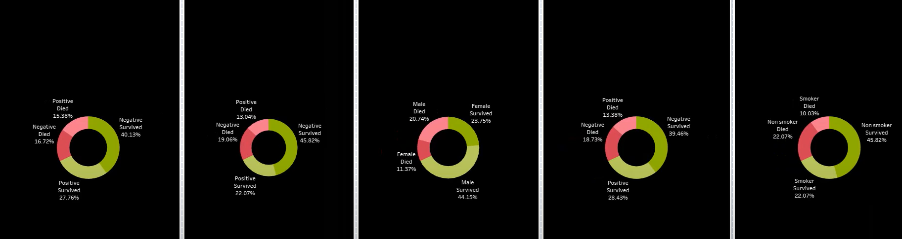

# Heart Failure Data Visualization — Tableau Dashboard

**Team Project by:**  
- Dhanushree C   
- Rachana P   

---

## 📊 Demo

### Donut Charts

### Histograms

---

## 🎯 Objective
Develop an interactive healthcare dashboard in Tableau that analyzes and visualizes key data related to **heart failure**.  
The goal is to enhance understanding, support decision-making, and promote proactive healthcare measures.

---

## 🗂️ Dataset
**Heart Failure Clinical Records Dataset**  
- Rows: 300  
- Columns: 13  
- Source: [Kaggle Dataset](https://www.kaggle.com/datasets/andrewmvd/heart-failure-clinical-data)  

⚠️ The full dataset is not uploaded here due to licensing.  
See `dataset_info.txt` for details.

---

## 🛠️ Tools Used
- Tableau (for dashboard creation)  
- Excel / Python (pandas) for preprocessing (optional)

---

## 📈 Visualizations
- Donut Charts → Survival status by anemia, blood pressure, sex, diabetes, smoking  
- Histograms → Age, Serum Creatinine, Ejection Fraction, Platelets, Creatinine Phosphokinase  
- Scatter Plot → Age vs Time survival status  
- Box Plot → Age vs Sex survival status  

---

## 📄 Files in this Repository
- `Report.pdf` — Project report  
- `Dashboard.pdf` — Tableau dashboard export  
- `images/` — Screenshots of visualizations  
- `dataset_info.txt` — Dataset source & info  
- `README.md` — This project overview  

---

## 📜 License
This project is licensed under the MIT License.  
